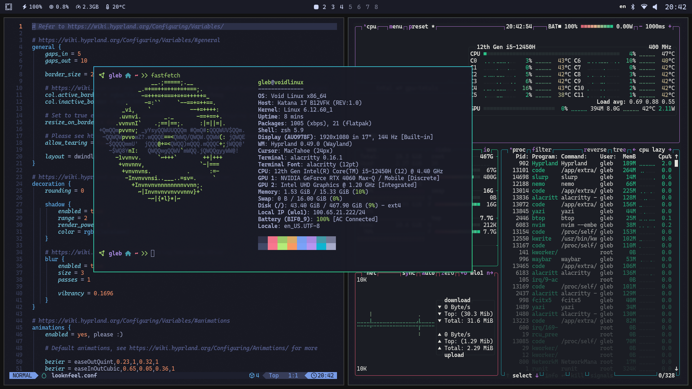

# omarchy-void

A complete Void Linux + Hyprland setup based on the original [**Omarchy**](https://github.com/basecamp/omarchy) configuration and my preferences.



## Features

- **Complete Hyprland Setup** - Full Wayland compositor with all necessary dependencies
- **System Configuration** - Optimized for Void Linux with runit services
- **Development Environment** - Modern tools and editors pre-configured
- **Theme Management** - Easy theme switching with automatic application configuration
- **Zsh Setup** - Modern shell with plugins and fzf integration
- **LazyVim** - Pre-configured Neovim setup based on LazyVim starter

## Installation

```bash
# Clone the repository
git clone https://github.com/lentra0/omarchy-void ~/.local/share/omarchy

# Run the installer
~/.local/share/omarchy/install.sh
```

The installer will automatically:
1. Install all necessary packages from Void Linux repositories
2. Configure system services and user groups
3. Set up Hyprland and Wayland environment
4. Install and configure development tools
5. Set up themes and cursor configuration
6. Reboot the system for all changes to take effect

## Module Structure

The installation is divided into logical modules:

| Module | Description |
|--------|-------------|
| `01-hyprland-core.sh` | Core Hyprland and Wayland packages |
| `02-graphics.sh` | Graphics drivers and Vulkan support |
| `03-system-services.sh` | System services, networking, authentication |
| `04-desktop-tools.sh` | Desktop environment tools and utilities |
| `05-shell.sh` | Zsh shell with plugins and configuration |
| `06-utilities.sh` | Various utilities and applications |
| `07-multimedia.sh` | Audio, video, and wallpaper tools |
| `08-theme.sh` | Theme configuration and LazyVim setup |
| `09-misc.sh` | System PATH configuration and cursor theme |

## Troubleshooting

- Installation log: `~/.cache/omarchy/logs/`

## Configuration

### Services Enabled

The following runit services are automatically enabled:

- `dbus` - Message bus system
- `crond` - Cron daemon for scheduled tasks
- `seatd` - Seat management daemon
- `elogind` - Login manager
- `polkitd` - PolicyKit authorization
- `bluetoothd` - Bluetooth service

## Keybindings

| Category | Key Combination | Action |
|----------|-----------------|--------|
| **Window Management** | `SUPER + Q` | Close window |
| | `SUPER + F` | Toggle fullscreen |
| | `SUPER + A` | Toggle floating mode |
| | `SUPER + J` | Toggle split direction |
| **Window Movement** | `SUPER + mouse drag` | Move window |
| | `SUPER ALT + ←/→/↑/↓` | Swap window position |
| | `SUPER CTRL + ←/→` | Move window to previous/next workspace |
| **Application Launch** | `SUPER + Return` | Open terminal |
| | `SUPER + D` | Application launcher |
| | `SUPER + B` | Open browser |
| | `SUPER + E` | Open file manager |
| | `SUPER + Y` | Open Yazi (TUI file manager) |
| **Tools & Utilities** | `SUPER + L` | Open LazyGit |
| | `SUPER + C` | Open LazyDocker |
| | `SUPER + T` | Open btop |
| **Workspace Control** | `SUPER + 1-8` | Switch to workspace 1-8 |
| | `SUPER + ←/→` | Switch to previous/next workspace |
| **System Controls** | `SUPER + ESC` | Lock screen |
| | `SUPER SHIFT + S` | Screenshot region |

---

*Note: These are the most commonly used keybindings. For a complete list, run `omarchy-menu-keybindings` in your terminal.*  
*Hold `SHIFT` with volume/brightness keys for fine adjustment.*

## Credits & Acknowledgments

This project builds upon the work of several amazing open-source projects:

### **Original Omarchy**
Massive thanks to the original [**Omarchy**](https://github.com/basecamp/omarchy) project by Basecamp. This configuration is a port of their excellent Arch Linux setup to Void Linux.

### **Hyprland Core**
Special thanks to [**Makrennel**](https://github.com/Makrennel/hyprland-void) and [**void-land**](https://github.com/void-land/hyprland-void-packages) for maintaining the Hyprland repositories for Void Linux.

### **ZSH Configuration**
Clean and efficient ZSH setup by [**gh0stzk**](https://github.com/gh0stzk/dotfiles), providing useful aliases, functions, and prompt customization.

### **Cursor Theme**
Beautiful cursor theme provided by [**vinceliuice**](https://github.com/vinceliuice/MacTahoe-icon-theme) with the MacTahoe icon theme.

## License

This project is licensed under the MIT License - see the [LICENSE](LICENSE) file for details.

## Disclaimer

This setup is tailored for my personal workflow and may not suit everyone's needs. Use at your own risk and always review scripts before running them on your system.
